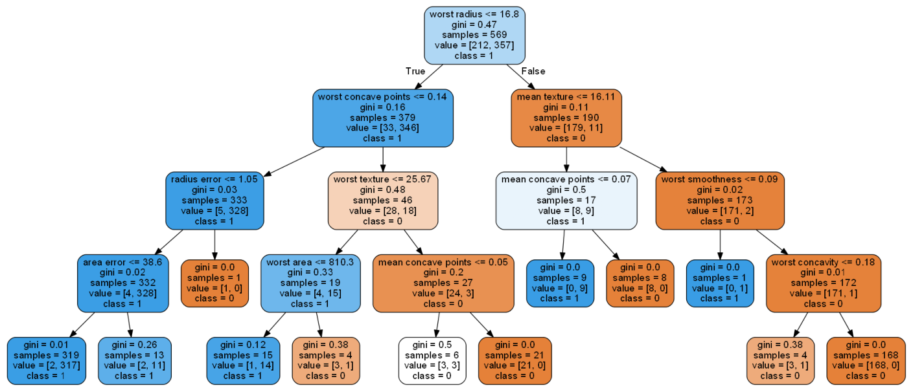

treeplot's documentation!
==============================

``treeplot`` is Python package to easily plot the tree derived from models such as decisiontrees, randomforest and xgboost. Developing explainable machine learning models is becoming more important in many domains. The most popular and classical explainable models are still tree based. Think of decision trees or random forest. The tree that is learned can be visualized and then explained. However, it can be a challange to simply plot the tree. Think of configuration issues with dot files, path locations to graphviz, differences across operating systems, differences across editors such as jupyter notebook, colab, spyder etc. This frustration led to this library, an easy way to plot the decision trees 🌲. It works for Random-forest, decission trees, xgboost and gradient boosting models. Under the hood it makes many checks, downloads graphviz, sets the path and then plots the tree.

Treeplot can be used for: **Random-forest**, **Decision trees**, **XGboost** and **Gradient boosting models**:

	* .plot		: Generic function to plot the tree of any of the four models with default settings
	* .randomforest : Plot the randomforest model.
	* .xgboost	: Plot the xgboost model.
	* .LightBM	: Plot the LightBM model.

.. table:: Example treeplot.
   :align: center

   +----------+
   | |figd|   |
   +----------+

Star is important
======================
If you ❤️ this project, **star** this repo at the `github page <https://github.com/erdogant/treeplot/>`_!

Github
======
Please report bugs, issues and feature extensions at `github <https://github.com/erdogant/treeplot/>`_.

Quick install
=============

.. code-block:: console

   pip install treeplot

Content
=======

.. toctree::
   :maxdepth: 1
   :caption: Installation
   
   Installation

.. toctree::
  :maxdepth: 1
  :caption: Tutorials

  Tutorials

.. toctree::
  :maxdepth: 1
  :caption: Plot

  Examples

.. toctree::
  :maxdepth: 1
  :caption: Documentation
  
  Documentation
  Coding quality
  treeplot.treeplot

Indices and tables
==================

* :ref:`genindex`
* :ref:`modindex`
* :ref:`search`

.. raw:: html

	

	

		
	

	

